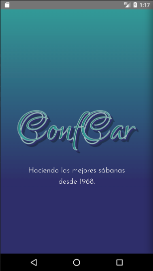
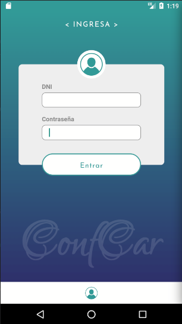
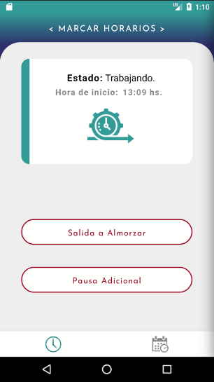
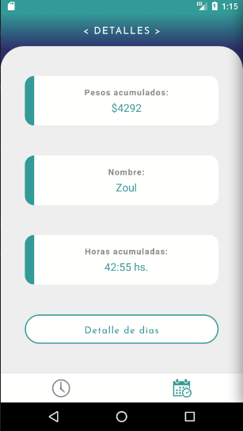
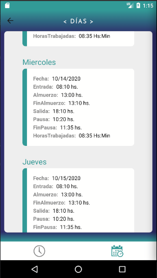

# Confcar employee's Work Schedule Marker client.

## Freelance project for a SME.

Confcar is a small business of bed sheets.

## Preview screenshots

_iOS version not tested._

## Tools:
* [react](https://es.reactjs.org/)
* [react-native](https://reactnative.dev/)
* [react-navigation](https://reactnavigation.org/) - Stacks and Bottom-Tabs
* [react-native-linear-gradient](https://www.npmjs.com/package/react-native-linear-gradient) - for gradient backgrounds.
* [react-native-community/async-storage](https://react-native-async-storage.github.io/async-storage/)
* [redux](https://redux.js.org/)
* [react-redux](https://react-redux.js.org/)
* [redux-thunk](https://www.npmjs.com/package/redux-thunk)
* [redux-persist](https://www.npmjs.com/package/redux-persist)
